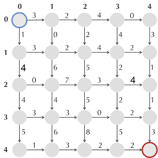

# The change problem revisited
An example of an impractical recursive solution to the change problem:

```js
/**
 * @parameter amount {integer} Amount to change.
 * @parameter coins {array of numbers} Currency available. E.g. [10, 5, 1, 0.5]
 */
function recursiveChange (amount, coins) {
  if (amount <= 0) {
    return 0;
  }
  var bestNumCoins = Infinity;
  for (var i = 0; i < coins.length; i += 1) {
    if (amount > coins[i]) {
      var numCoins = recursiveChange(amount - coins[i], coins);
      if (numCoins + 1 < bestNumCoins) {
        bestNumCoins = numCoins;
      }
    }
  }
  return bestNumCoins;
}

// impractical, too many recursive calls
// recursiveChange(77, [7, 3, 1]);
```

Improved algorithm. Reverses the problem and takes advantage over that the next computation is dependent on the previous.

```js
/**
 * Gives minimum number of coins needed to change given amount. NB, only works
 * with integer coins.
 *
 * @parameter amount {integer}
 * @parameter coins {array of integers}
 */
function dynamicProgrammingChange (amount, coins) {
  var bestNumCoins = [0];
  for (var m = 1; m <= amount; m += 1) {
    bestNumCoins[m] = Infinity;
    for (var i = 0; i < coins.length; i += 1) {
      var coin = coins[i];
      if (m >= coin) {
        //  undefined + 1 < number = NaN < number = false
        if (bestNumCoins[m - coin] + 1 < bestNumCoins[m]) {
          bestNumCoins[m] = bestNumCoins[m - coin] + 1;
        }
      }
    }
  }
  return bestNumCoins[amount];
}

dynamicProgrammingChange(77, [7, 3, 1]);
// 11
```

# The Manhattan tourist problem
Visit as many attractions from source to sink. Move only east and south. Edges are weighted.



```js
var east = [
  [3, 2, 4, 0],
  [3, 2, 4, 2],
  [0, 7, 3, 4],
  [3, 3, 0, 2],
  [1, 3, 2, 2] ];
var south = [
  [1, 0, 2, 4, 3],
  [4, 6, 5, 2, 1],
  [4, 4, 5, 2, 1],
  [5, 6, 8, 5, 3] ];

function Manhattan (southEdges, eastEdges) {
  var verticesSouth = eastEdges.length;
  var verticesEast = southEdges[0].length;

  var score = [[0]];

  // scores first column
  for (var i = 1; i < verticesSouth; i += 1) {
    score.push([]);
    score[i][0] = score[i - 1][0] + southEdges[i - 1][0];
  }

  // scores first row
  for (var i = 1; i < verticesEast; i += 1) {
    score[0][i] = score[0][i - 1] + eastEdges[0][i - 1];
  }

  for (var i = 1; i < verticesSouth; i += 1) {
    for (var j = 1; j < verticesEast; j += 1) {
      score[i][j] = Math.max(
        score[i - 1][j] + southEdges[i - 1][j],
        score[i][j - 1] + eastEdges[i][j - 1]
      );
    }
  }
  return score[verticesSouth - 1][verticesSouth - 1];
}

Manhattan(south, east);
// 34
// score = [
// [ 0,   3,  5,  9,  9 ],
// [ 1,   4,  7, 13, 15 ],
// [ 5,  10, 17, 20, 24 ],
// [ 9,  14, 22, 22, 25 ],
// [ 14, 20, 30, 32, 34 ] ]
```


# LCS - Longest common subsequence

General algorithm:

LCS (v, w)
  for i <- 0 to n
    s_i,0 <- 0
  for j <- 0 to m
    s_o,j <- 0
  for i <- 1 to n
    for j <- 1 to m
      s_i,j <- max( s_i-1,j ; s_i,j-1 ; s_i-1,j-1 )
      b_i,j <-
        ↑ if s_i,j = s_i-1,j
        ← if s_i,j = s_i,j-1
        ↖ if s_i,j = s_i-1,j-1 + 1
  return s_n,m ; b

The general algorithm have a bug. Several of conditions for b_i,j could hold
true, giving wrong direction. Example:

    A T C
  0 0 0 0
A 0 1 1 1
T 0 1 2 2
A 0 1 2 2

Should give

    A T C
    ← ← ←
A ↑ ↖ ← ←
T ↑ ↑ ↖ ←
A ↑ ↖ ↑ ↑

not

    A T C
    ← ← ←
A ↑ ↖ ← ←
T ↑ ↑ ↖ ←
A ↑ ↑ ↑ ↑
    ↑
  error

In other words, if v_i == w_j, we should always have ↖.


```js
/**
 * Longest common subsequence.
 *
 * @parameter v {string}
 * @parameter w {string}
 */
function LCS (v, w) {
  var n = v.length;
  var m = w.length;

  // initialize
  var score = [];
  var b = [];
  for (var i = 0; i <= n; i += 1) {
    score.push([0]);
    b.push(['↑']);
  }
  for (var j = 1; j <= m; j += 1) {
    score[0][j] = 0;
    b[0][j] = '←';
  }

  for (var i = 1; i <= n; i += 1) {
    for (var j = 1; j <= m; j += 1) {
      if (v[i - 1] === w[j - 1]) {
        score[i][j] = score[i - 1][j - 1] + 1;
        b[i][j] = '↖';
      } else if (score[i - 1][j] >= score[i][j - 1]) {
        score[i][j] = score[i - 1][j];
        b[i][j] = '↑';
      } else {
        score[i][j] = score[i][j - 1];
        b[i][j] = '←';
      }
    }
  }
  return {score, b};
}

LCS('ATCTGAT', 'TGCATA');

// { score:
//    [ [ 0, 0, 0, 0, 0, 0, 0 ],
//      [ 0, 0, 0, 0, 1, 1, 1 ],
//      [ 0, 1, 1, 1, 1, 2, 2 ],
//      [ 0, 1, 1, 2, 2, 2, 2 ],
//      [ 0, 1, 1, 2, 2, 3, 3 ],
//      [ 0, 1, 2, 2, 2, 3, 3 ],
//      [ 0, 1, 2, 2, 3, 3, 4 ],
//      [ 0, 1, 2, 2, 3, 4, 4 ] ],
//   b:
//    [ [ '↑', '←', '←', '←', '←', '←', '←' ],
//      [ '↑', '↑', '↑', '↑', '↖', '←', '↖' ],
//      [ '↑', '↖', '←', '←', '↑', '↖', '←' ],
//      [ '↑', '↑', '↑', '↖', '←', '↑', '↑' ],
//      [ '↑', '↖', '↑', '↑', '↑', '↖', '←' ],
//      [ '↑', '↑', '↖', '↑', '↑', '↑', '↑' ],
//      [ '↑', '↑', '↑', '↑', '↖', '↑', '↖' ],
//      [ '↑', '↖', '↑', '↑', '↑', '↖', '↑' ] ] }
```

Printing the result.

```js
function printLCS (b, v, i, j) {
  i = (i === undefined) ? b.length - 1 : i;
  j = (j === undefined) ? b[0].length - 1 : j;

  if (i === 0 || j === 0) {
    return '';
  }

  if (b[i][j] === '↖') {
    return printLCS(b, v, i - 1, j - 1) + v[i - 1];  // v[i - 1] because of 0-indexing
  }

  if (b[i][j] === '↑') {
    return printLCS(b, v, i - 1, j);
  }

  return printLCS(b, v, i, j - 1);
}

var res = LCS('ATCTGAT', 'TGCATA');

printLCS(res.b, 'ATCTGAT');
// 'TCTA'
```
